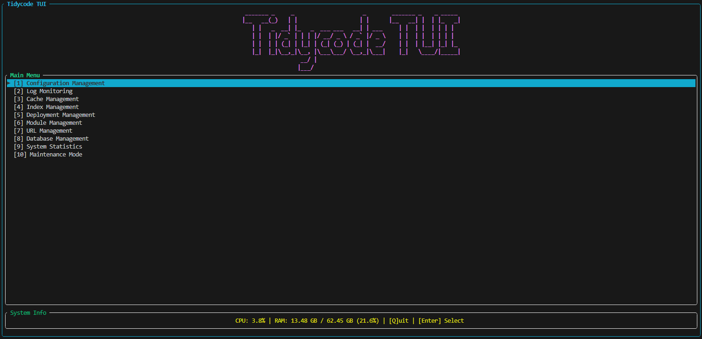
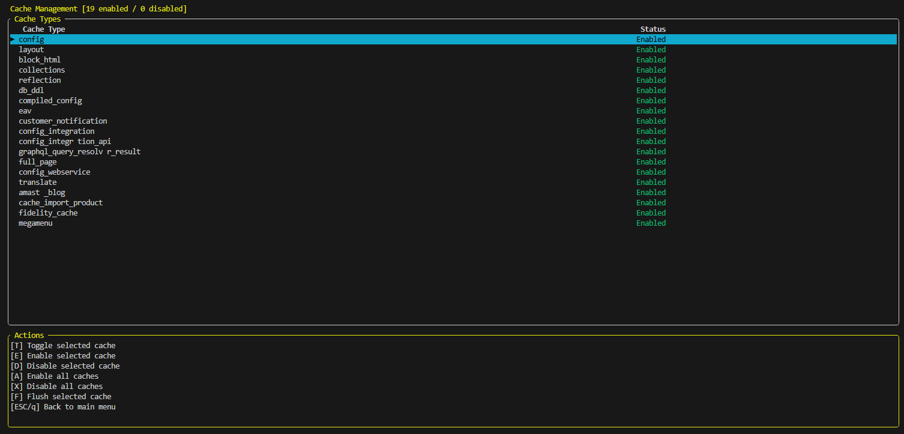
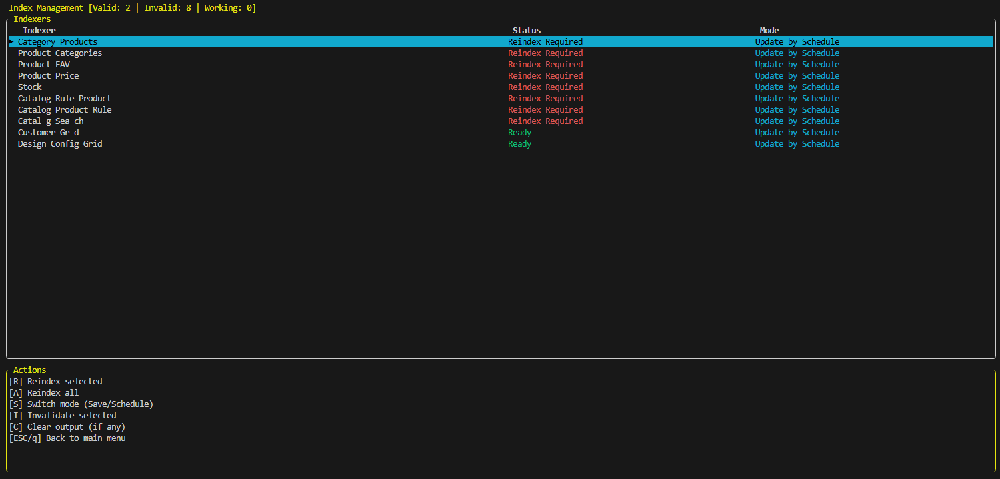
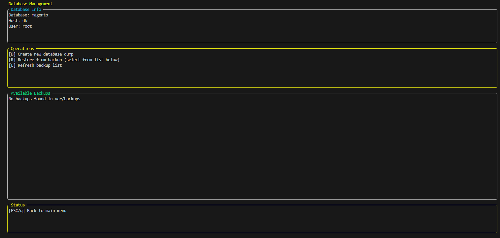
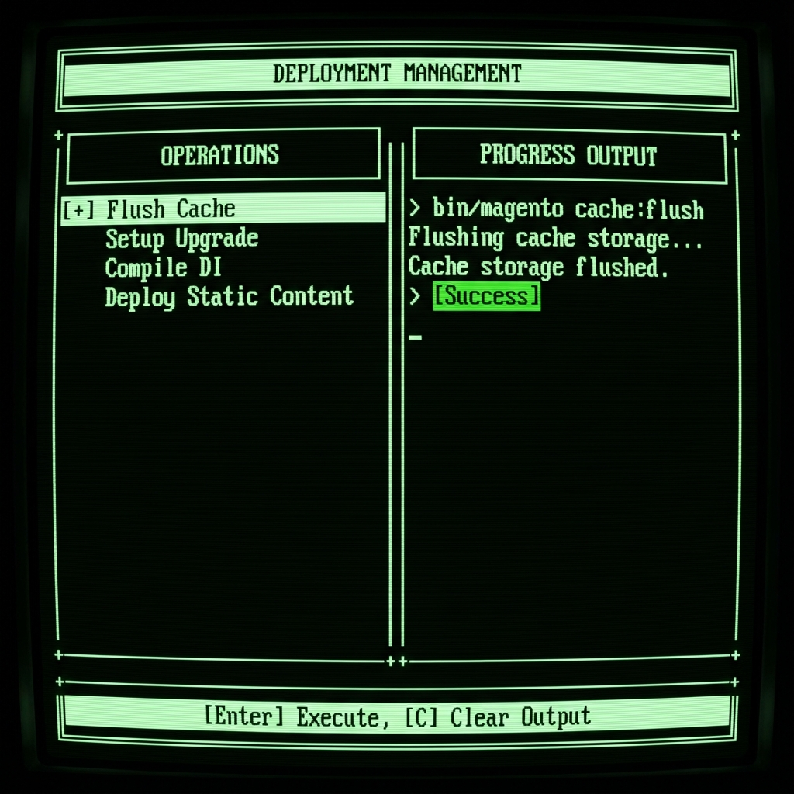
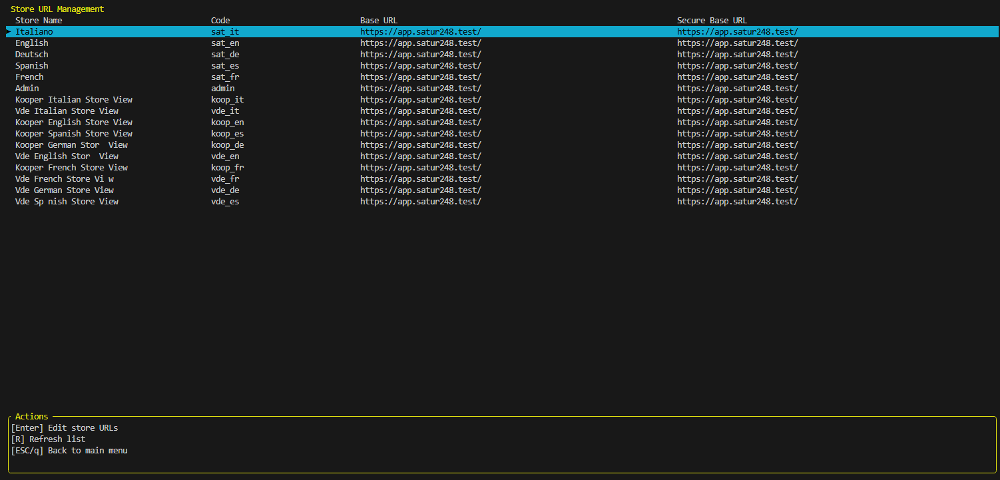
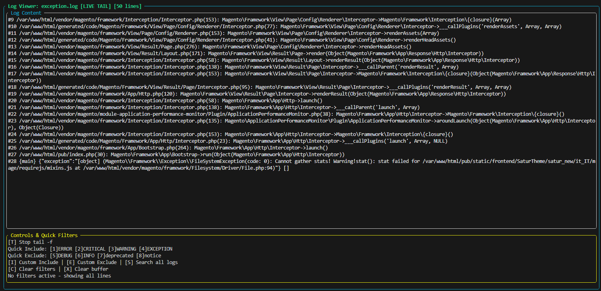
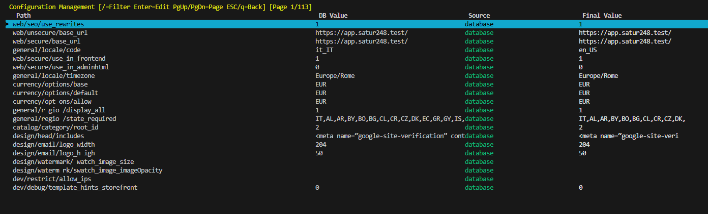
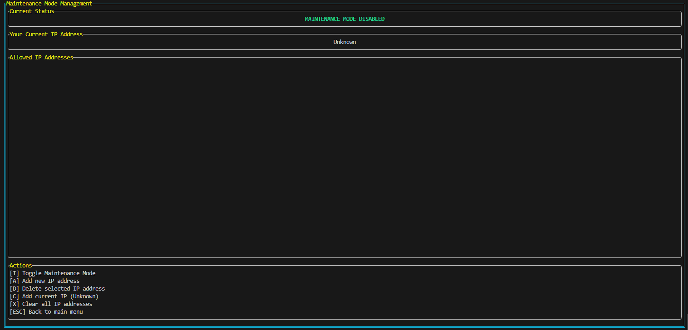

#### A powerful, interactive Terminal User Interface (TUI) for managing Magento 2 instances directly from the command line. Built with `php-tui/php-tui`, this module provides a rich, dashboard-like experience for developers and system administrators, eliminating the need to remember complex CLI commands.

## 🚀 Features

### 1. Dashboard

- **System Stats**: Real-time CPU and RAM usage monitoring.
- **Magento Metrics**: View cache status, current mode (Developer/Production), recent orders, and top search terms.
- **Auto-Refresh**: Dashboard updates automatically to show the latest data.

### 2. Cache Management

- **View Status**: See the status (Enabled/Disabled/Invalidated) of all cache types.
- **Actions**:
  - `[F]` Flush individual caches.
  - `[A]` Flush all caches.
  - `[T]` Toggle individual cache status.
  - `[E]` Enable all caches.
  - `[D]` Disable all caches.

### 3. Index Management

- **Status Overview**: Monitor the state of all indexers (Valid, Invalid, Working).
- **Mode Control**: Switch indexers between "Update on Save" and "Update by Schedule".
- **Reindexing**:
  - `[R]` Reindex selected indexer.
  - `[A]` Reindex all indexers.
  - **Progress Tracking**: Watch reindexing output in real-time.

### 4. Database Management

- **Info**: View current database name, host, and user.
- **Backups**: List available backups in `var/backups`.
- **Operations**:
  - `[D]` Create a new database dump (gzip compressed).
  - `[R]` Restore database from a selected backup.
  - **Safety**: Confirmation modals prevent accidental dumps or restores.

### 5. Deployment Management

- **Async Operations**: Run long-running deployment tasks without blocking the UI.
- **Tasks**:
  - Flush Cache (`cache:flush`)
  - Setup Upgrade (`setup:upgrade`)
  - Compile DI (`setup:di:compile`)
  - Deploy Static Content (`setup:static-content:deploy`)
- **Live Output**: View the command output stream in real-time.

### 6. Module Management

- **Listing**: View all installed modules with their version and status.
- **Filtering**: Press `[F]` to filter modules by name (non-blocking input).
- **Toggle**: Enable or disable modules instantly.
- **Error Details**: Press `[V]` to view detailed error messages if an operation fails.

### 7. URL Management

- **Store View**: List all stores and their Base URLs.
- **Editing**: Interactive modal flow to safely update Base URL and Secure Base URL.

### 8. Log Monitoring

- **File List**: View available log files and their sizes.
- **Live Tail**: Press `Enter` to tail a log file in real-time (like `tail -f`).
- **Filtering**:
  - **Quick Filters**: Toggle visibility of ERROR, CRITICAL, WARNING, etc.
  - **Custom Filters**: Press `[I]` to include or `[E]` to exclude lines matching a custom pattern.
- **Search**: Press `[S]` to search across all log files for a specific string.

### 9. Configuration Viewer

- **Browse**: Navigate through all `core_config_data` values.
- **Search**: Press `/` to filter configurations by path or value.
- **Edit**: Press `Enter` to modify a configuration value directly.
- **Source Tracking**: See whether a value comes from `env.php`, `config.php`, or the database.

### 10. Maintenance Mode

- **Toggle**: Enable or disable maintenance mode with `[T]`.
- **IP Whitelist**:
  - `[A]` Add a new IP to the whitelist.
  - `[C]` Add your current IP automatically.
  - `[D]` Remove selected IP.

## 📦 Installation

1.  **Require the module via Composer**:
    ```bash
    composer require tidycode/module-tui
    ```

2.  **Enable the module**:
    ```bash
    bin/magento module:enable Tidycode_TUI
    bin/magento setup:upgrade
    ```

## 🎮 Usage

Launch the TUI using the following command:

```bash
bin/magento tidycode:tui
```

### Global Navigation

- **Arrow Keys (↑/↓/←/→)**: Navigate menus and lists.
- **Enter**: Select an item, confirm an action, or start editing.
- **Esc**: Go back, cancel an action, or close a modal.
- **q**: Quit the application (or go back).
- **Number Keys (0-9)**: Quick access to main menu items.

## 🔧 Requirements

- Magento 2.4.x
- PHP 8.1+
- `php-tui/php-tui` library (installed automatically via Composer)
- Terminal with ANSI color support

## 🤝 Contributing

Contributions are welcome! Please open an issue or submit a pull request on GitHub.

## 📄 License

MIT License. See [LICENSE](LICENSE) for details.
## Tecnologie

- **php-tui/php-tui** v0.2.1 - Framework TUI
- **Symfony Console** - Base command
- **Magento 2 Services** - Business logic
