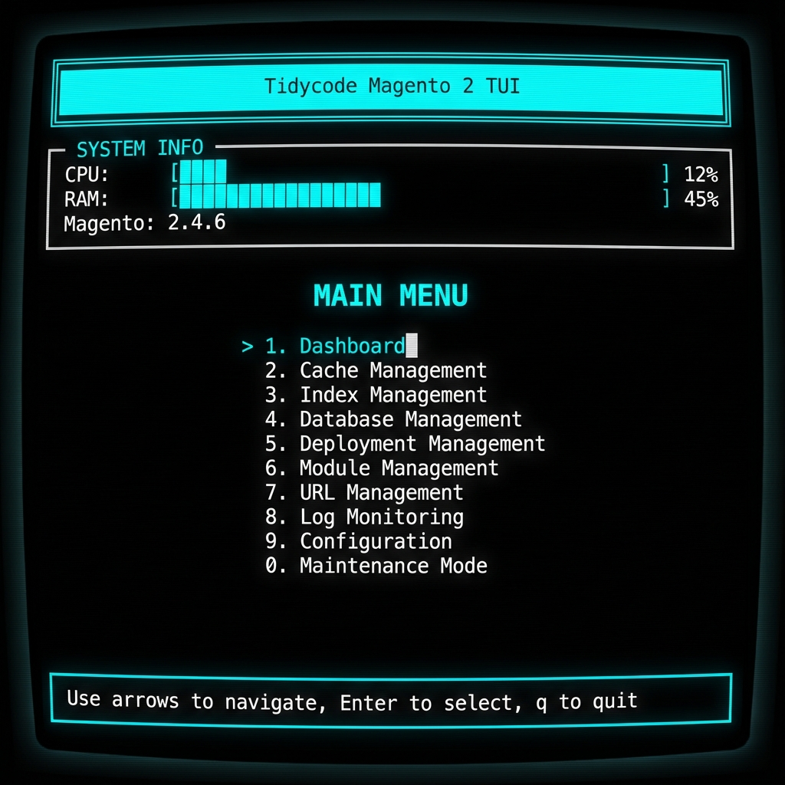
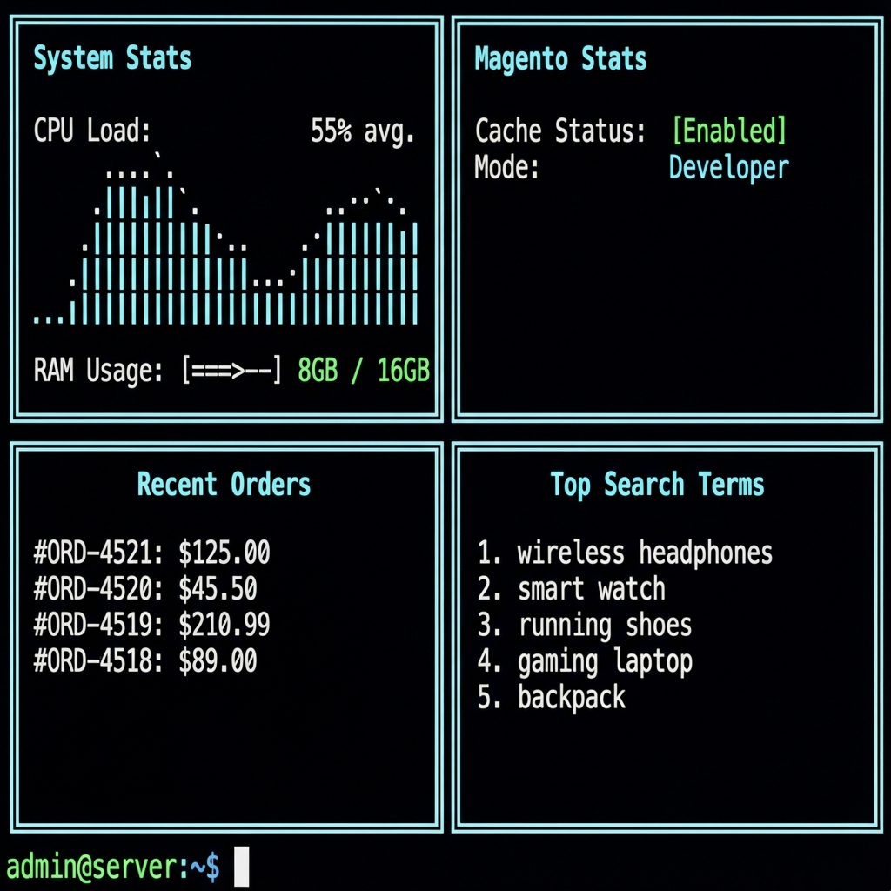

- **Enter** - Seleziona/conferma
- **ESC** - Torna al menu principale
- **Q** - Esci (solo dal menu principale)

### Azioni Specifiche

**Main Screen & Dashboard:**
- Auto-refresh automatico ogni ~1 secondo
- Visualizzazione real-time ordini e metriche sistema

**Cache Management:**
- **F** - Flush cache selezionata
- **T** - Toggle enable/disable cache

## Schermate Disponibili

### 1. Main Screen 🏠 **[SIMPLIFIED & ENHANCED]**
Schermata principale pulita con menu principale e avviso maintenance:

```
┌─══ TIDYCODE TUI v1.0 ══──────────────────────────────────────────┐
│                                                                    │
│ ================================================================================│
│            WARNING: MAINTENANCE MODE IS CURRENTLY ENABLED          │
│               The site is not accessible to customers              │
│ ================================================================================│
│                                                                    │
│                    ████████╗██╗██████╗ ██╗   ██╗                  │
│                    ╚══██╔══╝██║██╔══██╗╚██╗ ██╔╝                  │
│                       ██║   ██║██║  ██║ ╚████╔╝                   │
│                       ██║   ██║██║  ██║  ╚██╔╝                    │
│                       ██║   ██║██████╔╝   ██║                     │
│                       ╚═╝   ╚═╝╚═════╝    ╚═╝                     │
│                          Terminal Interface                        │
│                                                                    │
│                     Magento 2 Backend Management                   │
│                                                                    │
│ +------------------------------------------------------------------------+ │
│ |                           MENU OPTIONS                                 | │
│ +------------------------------------------------------------------------+ │
│ | > 1. Live Dashboard - Full metrics, online customers, real-time data  | │
│ |   2. Configuration Management - View and edit Magento configuration   | │
│ |   3. Log Monitoring - View and analyze system logs in real-time       | │
│ |   4. Cache Management - Flush and manage all cache types              | │
│ |   5. System Statistics - Detailed system and database information     | │
│ |   6. Maintenance Mode - Enable/disable maintenance and manage IPs     | │
│ +------------------------------------------------------------------------+ │
│                                                                    │
│ CPU: 12.5%  |  RAM: 2.4GB / 8.0GB (30.0%)  |  [Q] Quit  |  [Up/Down] Navigate│
│                                                                    │
└────────────────────────────────────────────────────────────────────┘
```

**Avviso Maintenance Mode:**
- Banner grande e prominente quando maintenance mode è abilitato
- Avvisa che il sito non è accessibile ai clienti
- Visibile immediatamente all'apertura della TUI

**Logo Tidycode:**
- ASCII art "TIDY" centrato in alto
- Design pulito e professionale
- Stile Terminal Interface

**Metriche Sistema (in basso):**
- **CPU Usage** - Utilizzo processore calcolato dinamicamente in base ai core disponibili (cappato a 100%)
- **RAM** - Memoria occupata / totale con percentuale
- Auto-refresh ogni ~1 secondo

**Menu:**
- 6 sezioni principali con descrizioni chiare
- Navigazione con frecce o numeri 1-6
- Indicatore visivo selezione corrente (>)
- Supporto tastiera completo ([Enter] per conferma, [Q] per uscita)

### 2. Live Dashboard 📊💰📈 **[COMPLETELY ENHANCED]**
Dashboard completa con statistiche in tempo reale su 4 pannelli:

**Pannello Live Metrics:**
- 🟢 Clienti attualmente online (ultimi 5 minuti)
- 📦 Totale ordini (all time)
- 🔄 Stato cache (enabled/disabled)
- 💾 Database (tabelle e dimensione)
- ⚙️ PHP version e memoria
- 🎯 Magento version

**Pannello Orders & Revenue:**
- Ordini di oggi con revenue
- Statistiche ultimi 7 giorni
- Statistiche del mese corrente
- Valore medio ordine
- Ordine massimo

**Pannello Customers:**
- Totale clienti registrati
- Nuovi clienti del mese
- Clienti online in questo momento

**Pannello Catalog:**
- Totale prodotti nel catalogo
- Prodotti abilitati
- Prodotti disabilitati

**Pannello RMA/Returns:**
- Totale resi/RMA (all time)
- Resi pendenti
- Resi del mese corrente

**Pannello Lifetime Revenue:**
- Revenue totale lifetime
- Valore medio ordine lifetime
- Ordine con valore massimo

**Recent Orders (Last 10):**
- Ultimi 10 ordini con ID, stato e totale

**Top Products (30 giorni):**
- Top 10 prodotti più venduti con quantità

# Tidycode Magento 2 TUI



A powerful, interactive Terminal User Interface (TUI) for managing Magento 2 instances directly from the command line. Built with `php-tui/php-tui`, this module provides a rich, dashboard-like experience for developers and system administrators, eliminating the need to remember complex CLI commands.

## 🚀 Features

### 1. Dashboard

- **System Stats**: Real-time CPU and RAM usage monitoring.
- **Magento Metrics**: View cache status, current mode (Developer/Production), recent orders, and top search terms.
- **Auto-Refresh**: Dashboard updates automatically to show the latest data.

### 2. Cache Management

- **View Status**: See the status (Enabled/Disabled/Invalidated) of all cache types.
- **Actions**:
  - `[F]` Flush individual caches.
  - `[A]` Flush all caches.
  - `[T]` Toggle individual cache status.
  - `[E]` Enable all caches.
  - `[D]` Disable all caches.

### 3. Index Management

- **Status Overview**: Monitor the state of all indexers (Valid, Invalid, Working).
- **Mode Control**: Switch indexers between "Update on Save" and "Update by Schedule".
- **Reindexing**:
  - `[R]` Reindex selected indexer.
  - `[A]` Reindex all indexers.
  - **Progress Tracking**: Watch reindexing output in real-time.

### 4. Database Management

- **Info**: View current database name, host, and user.
- **Backups**: List available backups in `var/backups`.
- **Operations**:
  - `[D]` Create a new database dump (gzip compressed).
  - `[R]` Restore database from a selected backup.
  - **Safety**: Confirmation modals prevent accidental dumps or restores.

### 5. Deployment Management

- **Async Operations**: Run long-running deployment tasks without blocking the UI.
- **Tasks**:
  - Flush Cache (`cache:flush`)
  - Setup Upgrade (`setup:upgrade`)
  - Compile DI (`setup:di:compile`)
  - Deploy Static Content (`setup:static-content:deploy`)
- **Live Output**: View the command output stream in real-time.

### 6. Module Management

- **Listing**: View all installed modules with their version and status.
- **Filtering**: Press `[F]` to filter modules by name (non-blocking input).
- **Toggle**: Enable or disable modules instantly.
- **Error Details**: Press `[V]` to view detailed error messages if an operation fails.

### 7. URL Management

- **Store View**: List all stores and their Base URLs.
- **Editing**: Interactive modal flow to safely update Base URL and Secure Base URL.

### 8. Log Monitoring

- **File List**: View available log files and their sizes.
- **Live Tail**: Press `Enter` to tail a log file in real-time (like `tail -f`).
- **Filtering**:
  - **Quick Filters**: Toggle visibility of ERROR, CRITICAL, WARNING, etc.
  - **Custom Filters**: Press `[I]` to include or `[E]` to exclude lines matching a custom pattern.
- **Search**: Press `[S]` to search across all log files for a specific string.

### 9. Configuration Viewer

- **Browse**: Navigate through all `core_config_data` values.
- **Search**: Press `/` to filter configurations by path or value.
- **Edit**: Press `Enter` to modify a configuration value directly.
- **Source Tracking**: See whether a value comes from `env.php`, `config.php`, or the database.

### 10. Maintenance Mode

- **Toggle**: Enable or disable maintenance mode with `[T]`.
- **IP Whitelist**:
  - `[A]` Add a new IP to the whitelist.
  - `[C]` Add your current IP automatically.
  - `[D]` Remove selected IP.

## 📦 Installation

1.  **Require the module via Composer**:
    ```bash
    composer require tidycode/module-tui
    ```

2.  **Enable the module**:
    ```bash
    bin/magento module:enable Tidycode_TUI
    bin/magento setup:upgrade
    ```

## 🎮 Usage

Launch the TUI using the following command:

```bash
bin/magento tidycode:tui
```

### Global Navigation

- **Arrow Keys (↑/↓/←/→)**: Navigate menus and lists.
- **Enter**: Select an item, confirm an action, or start editing.
- **Esc**: Go back, cancel an action, or close a modal.
- **q**: Quit the application (or go back).
- **Number Keys (0-9)**: Quick access to main menu items.

## 🔧 Requirements

- Magento 2.4.x
- PHP 8.1+
- `php-tui/php-tui` library (installed automatically via Composer)
- Terminal with ANSI color support

## 🤝 Contributing

Contributions are welcome! Please open an issue or submit a pull request on GitHub.

## 📄 License

MIT License. See [LICENSE](LICENSE) for details.
## Tecnologie

- **php-tui/php-tui** v0.2.1 - Framework TUI
- **Symfony Console** - Base command
- **Magento 2 Services** - Business logic
